<p align="center">
  <h1 align="center">HiHR: Hierarchical Hyperbolic Representation for Aerial-Ground Person Re-Identification</h1>
  <p align="center">
    <a href="https://github.com/YangQiWei3" rel="external nofollow noopener" target="_blank"><strong>Qiwei Yang*</strong></a>
    ·
    <a href="https://scholar.google.com/citations?user=MfbIbuEAAAAJ&hl=zh-CN" rel="external nofollow noopener" target="_blank"><strong>Pingping Zhang</strong></a>
</p>

<p align="center">
    <a href="https://arxiv.org/abs/2607.09186" rel="external nofollow noopener" target="_blank">ECCV 2026 Paper</a>
</p>

<p align="center">
    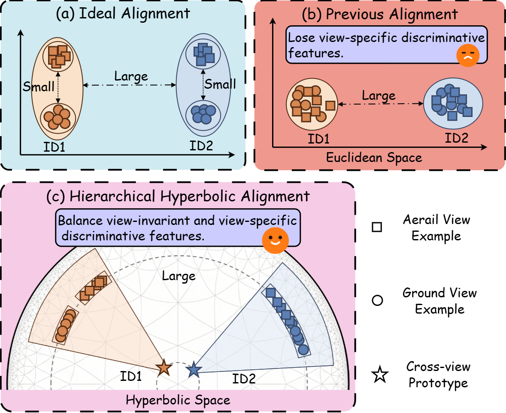
</p>
<p align="center" style="font-size: 18px; color: gray;">
    Figure 1: Motivation of HiHR.
</p>

<p align="center">
    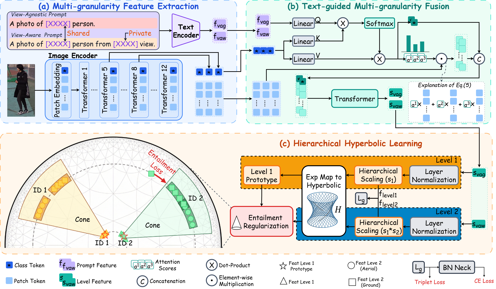
</p>
<p align="center" style="font-size: 18px; color: gray;">
    Figure 2: Overall Framework of HiHR.
</p>

<p align="center">
    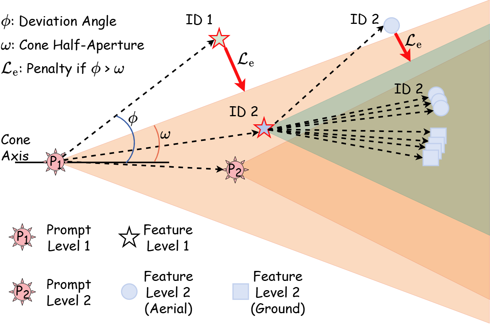
</p>
<p align="center" style="font-size: 18px; color: gray;">
    Figure 3: Entailment Regularizations for Hierarchical Consistency in HHL.
</p>

## **Abstract** 📝

Aerial-Ground Person Re-IDentification (AG-ReID) aims to retrieve the same person across heterogeneous aerial and ground camera platforms. Although great progress has been made, existing methods remain suboptimal due to the direct feature alignment across views, overlooking view-specific cues. To address this issue, we propose a novel Hierarchical Hyperbolic Representation (HiHR) framework for AG-ReID. More specifically, we first extract multi-granularity features based on pre-trained visual-text encoders. Then, we propose a Text-guided Multi-granularity Fusion (TMF) to fuse multi-granularity features and enhance the representation ability of identity features. Furthermore, we introduce the Hierarchical Hyperbolic Learning (HHL) to construct a hierarchical feature structure in a hyperbolic space. This hierarchy includes a coarse level that ensures identity separability and cross-view consistency, and a fine level that preserves view-specific discriminative cues. As a result, our proposed framework can effectively aggregate view-invariant and view-specific discriminative features for AG-ReID. Extensive experiments on four AG-ReID benchmarks demonstrate the effectiveness of our framework.


## News 📢

- We released the **HiHR** codebase!
- Great news! Our paper has been accepted to **ECCV 2026**! 🏆


#### Related Work from Our Group

- [Awesome AG-ReID](https://github.com/YangQiWei3/Awesome-Aerial-Ground-Object-Re-Identification)(curated list): papers, datasets, codebases and challenges on AG-ReID.  
- [AG-ReID Leaderboards](https://github.com/YangQiWei3/Awesome-Aerial-Ground-Object-Re-Identification/blob/main/leaderboards/ag_reid_leaderboards.pdf): leaderboards for AG-ReID.


## Table of Contents 📑

- [Introduction 🌟](#introduction-)
- [Quick View 📊](#quick-view-)
- [Quick Start 🚀](#quick-start-)
- [Star History 🌟](#star-history-)
- [Citation 📚](#citation-)


## Introduction 🌟
In **Aerial-Ground Person Re-IDentification (AG-ReID)**, ground cameras provide detailed close-range observations, while aerial sensors offer wide-area coverage. This introduces systematic viewpoint discrepancies and substantial appearance gaps. Existing AG-ReID methods commonly align aerial and ground samples directly in Euclidean feature spaces. Although such alignment can strengthen view-invariant identity cues, it may also suppress **view-specific discriminative information** that remains useful for reliable retrieval. In addition, many methods rely mainly on global representations, which capture high-level semantics but may weaken mid-level structural cues and fine-grained local patterns.

To address these limitations, we propose **HiHR**, a **Hierarchical Hyperbolic Representation** framework for AG-ReID. HiHR first introduces text prompts to extract **multi-granularity features** from pre-trained visual-text encoders. It then designs **Text-guided Multi-granularity Fusion (TMF)** to fuse these features and enhance identity representation. Furthermore, **Hierarchical Hyperbolic Learning (HHL)** constructs a coarse-to-fine feature hierarchy in hyperbolic space, where the coarse level promotes identity separability and cross-view consistency, while the fine level preserves view-specific discriminative cues. Entailment-cone regularization further maintains hierarchical consistency by propagating identity-consistent separation from the coarse level to the fine level.
As a result, HiHR effectively aggregates both **view-invariant** and **view-specific** discriminative features for AG-ReID. Extensive experiments on four AG-ReID benchmarks demonstrate the effectiveness and competitiveness of the proposed framework.


## **Contributions** ✨
- We propose **HiHR**, a novel **Hierarchical Hyperbolic Representation** framework for AG-ReID. To the best of our knowledge, this is the first work to utilize hyperbolic representations for cross-view person retrieval.
- We propose **TMF** to fuse view-invariant and view-specific discriminative features across multiple granularities.
- We propose **HHL** to model coarse-to-fine representation structures of cross-view and view-specific features in hyperbolic space.
- Extensive experiments on four benchmarks demonstrate that HiHR achieves competitive or state-of-the-art performance, especially in map.

---

## Quick View 📊
<!-- ### Dataset Examples
#### Overview of Annotations 
<p align="center">
    
</p>

#### Multi-modal Person ReID Annotations Example
<p align="center">
    
</p>

#### Multi-modal Vehicle ReID Annotations Example
<p align="center">
    
</p> -->

### Experimental Results

<p align="center">
  <a href="https://github.com/YangQiWei3/Awesome-Aerial-Ground-Object-Re-Identification/blob/main/leaderboards/ag_reid_leaderboards.pdf">🏆  Leaderboards</a>
</p>

#### Performance comparison on AG-ReID and AG-ReID v2
<p align="center">
  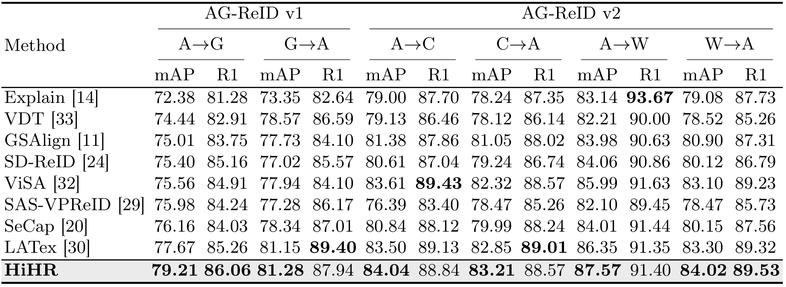
</p>

#### Performance comparison on LAGPeR
<p align="center">
    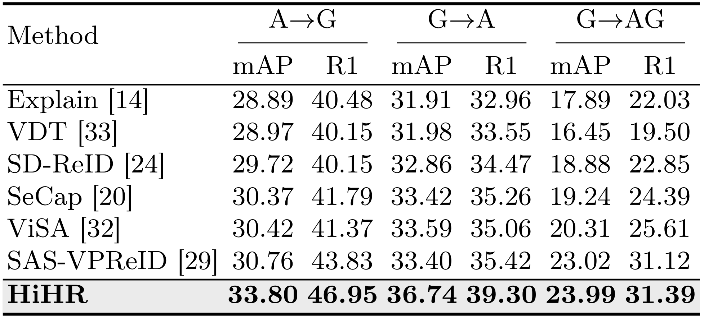
</p>

#### Performance comparison on CARGO
<p align="center">
    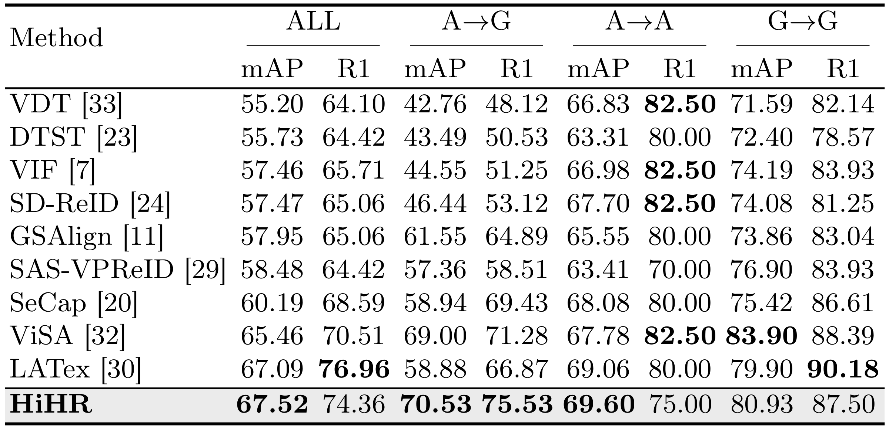
</p>

#### Ablation study of each module on CARGO
<p align="center">
    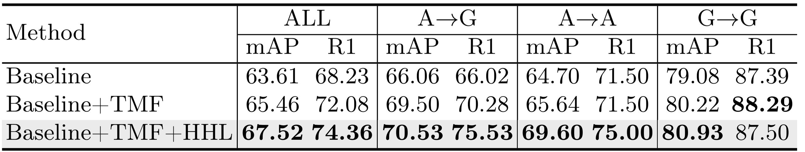
</p>

#### Hyperparameter and layer-selection analysis on CARGO
<p align="center">
    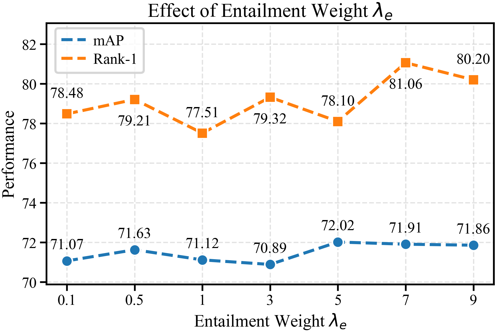
    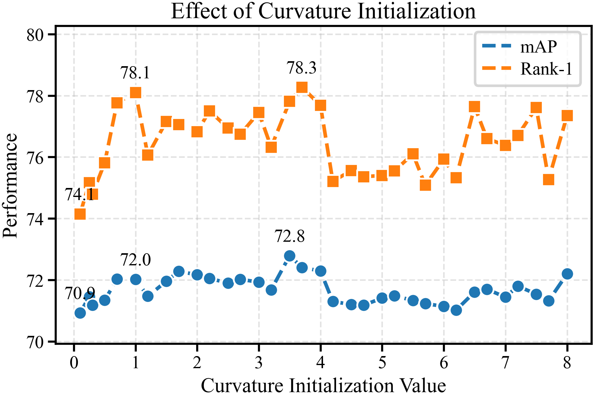
    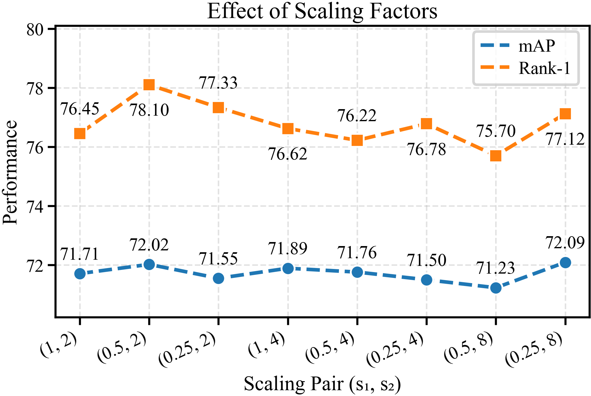
    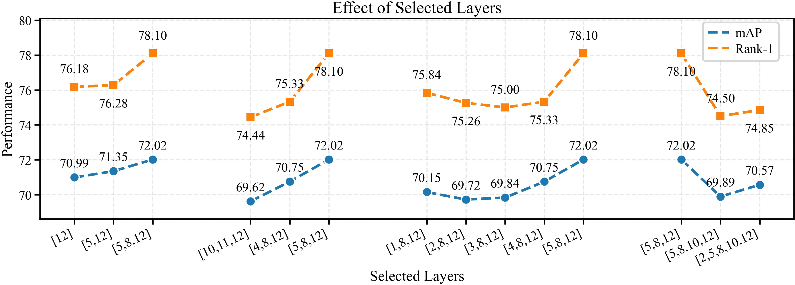
</p>

#### Ablation study of loss functions on CARGO
<p align="center">
    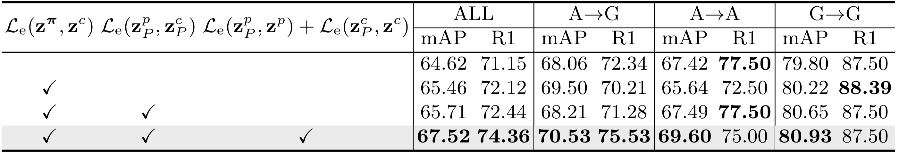
</p>

#### Ablation study of the prompt design on CARGO
<p align="center">
    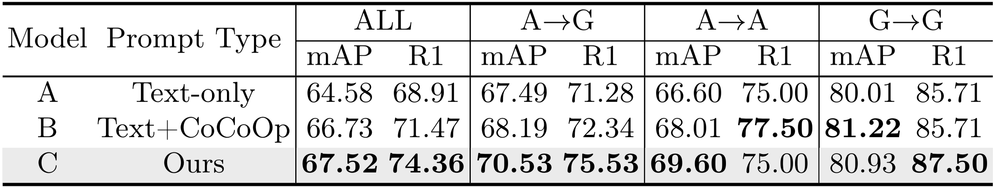
</p>

#### Ablation study of the fusion design on CARGO
<p align="center">
    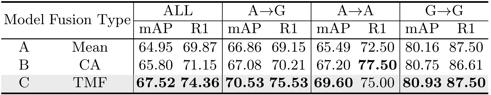
</p>

## Quick Start 🚀

### Datasets
- **AGReID**: [Google Drive](https://drive.google.com/file/d/1hzieEPlXfjkN3V3XWqI5rAwpF_sCF1K9/view)
- **AGRelDv2**: [Google Drive](https://drive.google.com/drive/folders/16r7G_CuUqfWG6_UCT7goIGRMqJird6vK)
- **LAGPeR**: [Baidu Pan](https://pan.baidu.com/share/init?surl=MRrhqoQzwxw7qOx4Lqdl2g)
- **CARGO**: [Google Drive](https://drive.google.com/file/d/1yDjyH0VtW7efxP3vgQjIqTx2oafCB67t/view)


### Codebase Structure
```
HiHR_Codes
├── README.md                         # Project overview, results, dataset links, and quick-start guide
├── requirements.txt                  # Python dependencies required by this project
├── train.sh                          # Example training commands for the supported datasets
├── configs/                          # Experiment configurations grouped by dataset
│   ├── AGReID/
│   │   └── HiHR.yml                  # Main HiHR configuration for AG-ReID
│   ├── ...
├── fastreid/                         # Core FastReID-based library used by HiHR
│   ├── config/                       # Global defaults and configuration utilities
│   ├── data/                         # Dataset registration, dataloaders, samplers, and transforms
│   │   ├── datasets/                 # Dataset adapters, including AGReID, AGReIDv2, CARGO, G2APS-ReID, and LAGPeR
│   │   ├── samplers/                 # Identity, triplet, modality, and imbalance samplers
│   │   └── transforms/               # Image augmentation and preprocessing transforms
│   ├── layers/                       # Reusable neural-network layers and normalization modules
│   ├── modeling/                     # Backbones, meta-architectures, heads, and losses
│   │   ├── backbones/
│   │   │   ├── vit_hihr.py           # HiHR CLIP-ViT backbone with hierarchical and hyperbolic components
│   │   │   ├── clip/                 # CLIP model and tokenizer utilities
│   │   │   └── manifolds/            # Lorentz/hyperbolic manifold operations
│   │   ├── meta_arch/
│   │   │   └── baseline_vit_hihr.py  # HiHR meta-architecture registered as Baseline_vit_HiHR
│   │   └── ...
├── tools/
│   └── plain_train_net.py            # Plain FastReID training script
└── ...
```

### Pretrained Models
- [Baidu Pan](https://pan.baidu.com/s/15bANGNElexAOVAzMTtQsXw?pwd=0369) (Code: `0369`) 

### Training
```bash
conda create -n HiHR python=3.9.12
conda activate HiHR
cd ../HiHR_PUBLIC
pip install --upgrade pip
pip install -r requirements.txt
#Training was performed on AGReID
CUDA_VISIBLE_DEVICES=0 python tools/train_net.py --config-file ./configs/AGReID/HiHR.yml MODEL.DEVICE 'cuda:0'
#Training was performed on AGReID.v2
CUDA_VISIBLE_DEVICES=0 python tools/train_net.py --config-file ./configs/AGReIDv2/HiHR.yml MODEL.DEVICE 'cuda:0'
#Training was performed on CAGRO
CUDA_VISIBLE_DEVICES=0 python tools/train_net.py --config-file ./configs/CARGO/HiHR.yml MODEL.DEVICE 'cuda:0'
#Training was performed on LAGPeR
CUDA_VISIBLE_DEVICES=0 python tools/train_net.py --config-file ./configs/LAGPeR/HiHR.yml MODEL.DEVICE 'cuda:0'
```
### Testing 
```bash
conda activate HiHR
cd ../HiHR_PUBLIC
#Testing was performed on AGReID
CUDA_VISIBLE_DEVICES=0 python tools/train_net.py --config-file ./configs/AGReID/MineHir.yml --eval-only MODEL.DEVICE 'cuda:0' MODEL.WEIGHTS ./logs/AG_ReID_v2/HiHR/**.pth
#Testing was performed on AGReID.v2
CUDA_VISIBLE_DEVICES=0 python tools/train_net.py --config-file ./configs/AGReIDv2/MineHir.yml --eval-only MODEL.DEVICE 'cuda:0' MODEL.WEIGHTS ./logs/AG_ReID_v2/HiHR/**.pth
#Testing was performed on CAGRO
CUDA_VISIBLE_DEVICES=0 python tools/train_net.py --config-file ./configs/CARGO/MineHir.yml --eval-only MODEL.DEVICE 'cuda:0' MODEL.WEIGHTS ./logs/CARGO/HiHR/**.pth
#Testing was performed on LAGPeR
CUDA_VISIBLE_DEVICES=0 python tools/train_net.py --config-file ./configs/LAGPeR/MineHir.yml --eval-only MODEL.DEVICE 'cuda:0' MODEL.WEIGHTS ./logs/LAGPeR/HiHR/**.pth
```

## Star History 🌟

[](https://star-history.com/#YangQiWei3/HiHR&Date)


## Citation 📚

If you find **HiHR** helpful in your research, please consider citing:
```bibtex
@article{yang2026hihr,
  title={HiHR: Hierarchical Hyperbolic Representation for Aerial-Ground Person Re-Identification},
  author={Yang, Qiwei and Zhang, Pingping},
  journal={arXiv preprint arXiv:2607.09186},
  year={2026}
}
```